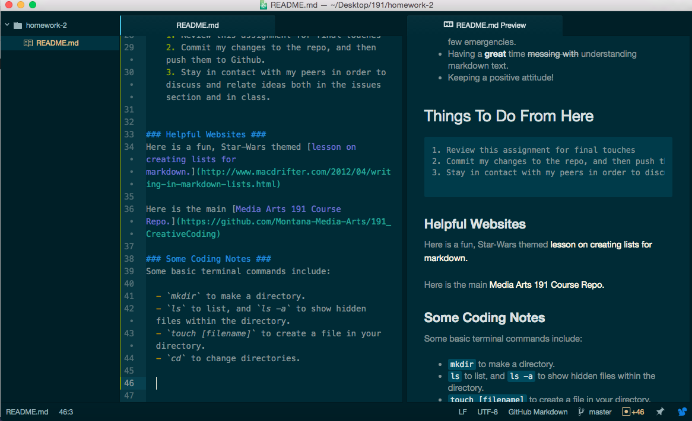

Weeks 1 and 2
====================

 I've had some difficulties and some successes in my first few classes.

## Problems

 Some problems I encountered include:

 - Becoming distracted and messing around on terminal because I feel like a hacker, thus missing important information.

 - Succumbing to self-doubt and becoming overwhelmed.

 - Making small typos that confuse and **anger** the computer.

 - Entering the wrong password into SourceTree, rendering it unable to function at all until the program is removed repeatedly, ~~causing mayhem and widespread panic~~ which was easily fixed.

## Successes

 Some victories I've had include:

  - Creating and navigating through directories and files through terminal.
  - Using Git, Github, SourceTree, and Atom with *relatively* few emergencies.
  - Having a **great** time ~~messing with~~ understanding markdown text.
  - Keeping a positive attitude!

  ## Things To Do From Here
    1. Review this assignment for final touches
    2. Commit my changes to the repo, and then push them to Github.
    3. Stay in contact with my peers in order to discuss and relate ideas both in the issues section and in class.

### Helpful Websites
Here is a fun, Star-Wars themed [lesson on creating lists for markdown.](http://www.macdrifter.com/2012/04/writing-in-markdown-lists.html)

Here is the main [Media Arts 191 Course Repo.](https://github.com/Montana-Media-Arts/191_CreativeCoding)

### Some Coding Notes
Some basic terminal commands include:

  - `mkdir` to make a directory.
  - `ls` to list, and `ls -a` to show hidden files within the directory.
  - `touch [filename]` to create a file in your directory.
  - `cd` to change directories.
 ### My Editor, Atom Versus Preview
  
