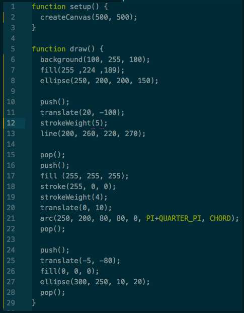
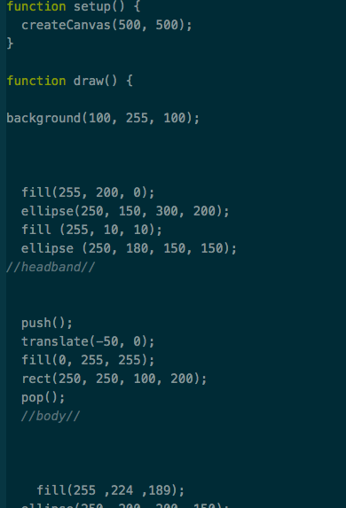
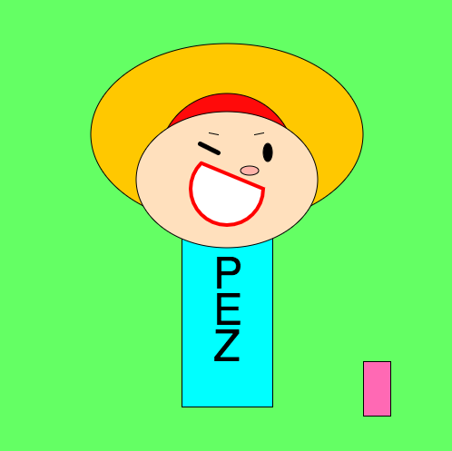
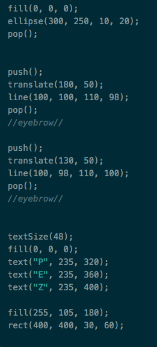

   ### Working with p5.js

  Sketching with p5.js is a *lot* more difficult than drawing regularly. I feel like I have to have an understanding of graphing in order to do this. The problem that I had was understanding where to place things in relation to each other. I ended up using a lot of push, pop, and translate to get my objects in the right place.

  ### Steps in the Process

  Here are some images from the process.

  

  

  

  

  

  

  (She's a bit embarrassed about her brief phase as a Pez dispenser)

  

  

  

  Overall, I enjoyed the project even though i struggled at times.

  Here is my hw-3 repo: https://lindseysewell.github.io/191-work/homework-3
